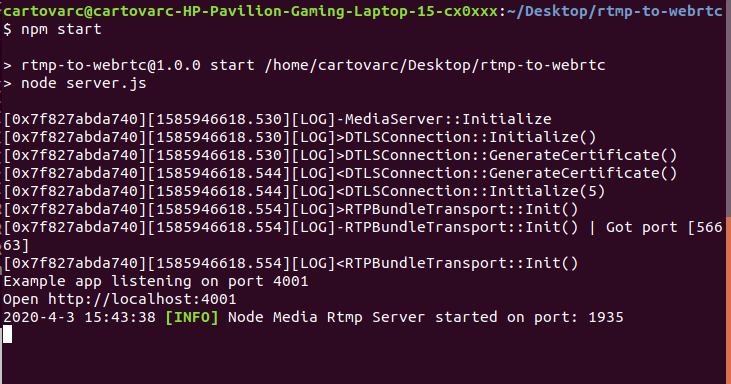
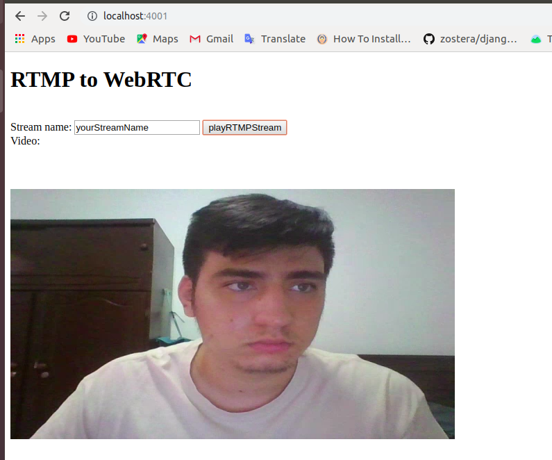

<h1 align="center">Welcome to opencv-to-webrtc 👋</h1>
<p>
  <a href="#" target="_blank">
    
  </a>
</p>

> This example allow you send cv2.VideoCapture(0) from python to NodeJS RTP server and then to a browser using WebRTC.

## Author

👤 **Carlos Tovar**

* Website: https://www.carlos-tovar.me
* Github: [@cartovarc](https://github.com/cartovarc)
* LinkedIn: [@carlos-fernando-tovar-ceron](https://linkedin.com/in/carlos-fernando-tovar-ceron)

## Requirements (my env)
- conda
- npm 6.13.7
- node v8.10.0

## Instructions
Get and start rtp server
```bash
$ git clone -b opencv-to-webrtc https://github.com/cartovarc/rtmp-to-webrtc.git
$ cd rtmp-to-webrtc
$ npm install
$ npm start
```

After 'npm start' you will get something like this:


Install conda and pip requirements in new env
```bash
$ conda create --name opencv-to-webrtc python=3.7
$ conda activate opencv-to-webrtc

$ conda install -c conda-forge pygobject
$ conda install -c conda-forge opencv
$ conda install -c conda-forge gst-plugins-base
$ conda install -c conda-forge gst-plugins-good
$ conda install -c sbugallo gst-plugins-ugly
$ conda install -c sbugallo gst-plugins-bad
$ pip install requests
```

Inside new env, clone this repo (at this point rtp server is running)
```bash
$ git clone https://github.com/cartovarc/opencv-to-webrtc.git
$ cd opencv-to-webrtc
$ python main.py yourStreamName
```

After 'python main.py yourStreamName' you will get something like this:


Then go to http://localhost:4001/ type 'yourStreamName' inside input and click on play button



and then you will get your camera streaming in browser :) 

## Show your support

Give a ⭐️ if this project helped you!

***
_This README was generated with ❤️ by [readme-md-generator](https://github.com/kefranabg/readme-md-generator)_